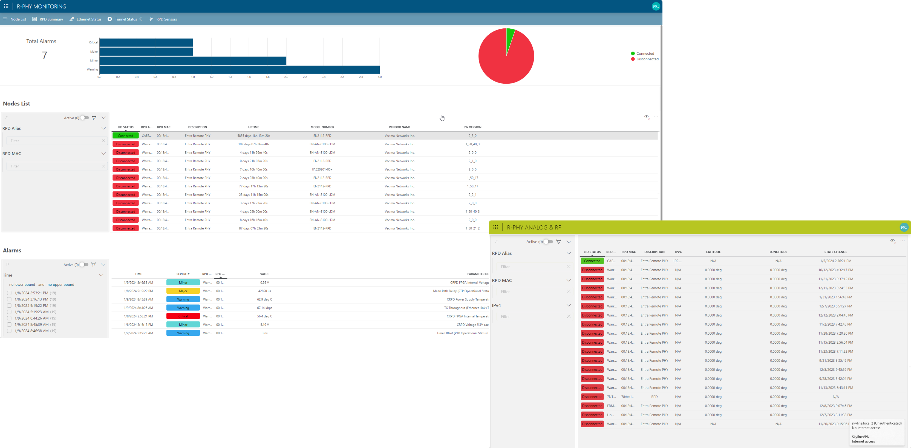
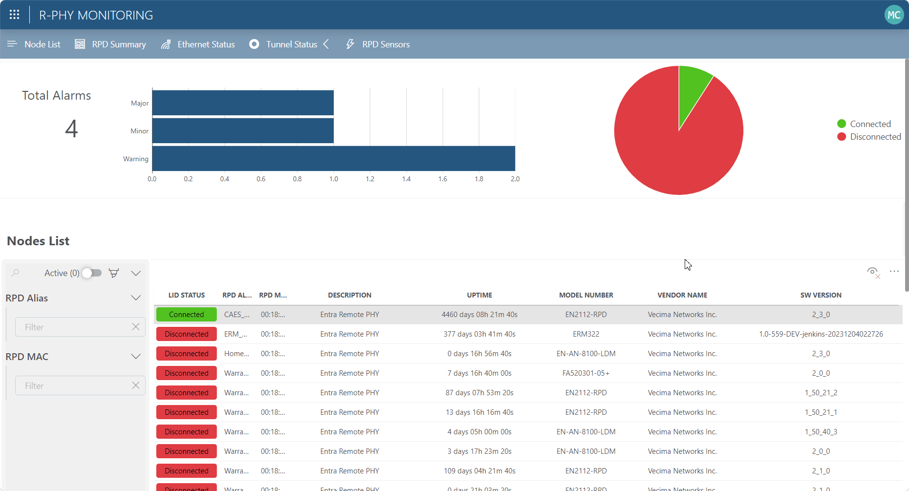

# Remote PHY Monitoring

## About
The current package contains two low-code apps and a Vecima RPM driver, as it is currently the only device supported for this solution.

## Key Features
The Remote PHY Monitoring package empowers you to effortlessly access and consolidate data from one or multiple Remote PHY devices.

The single entry point provided for the operator's entire installed base of Remote PHY nodes eliminates the need for operators to hop between the interfaces of the different RPM elements, as necessary to support the actual volume of these.

